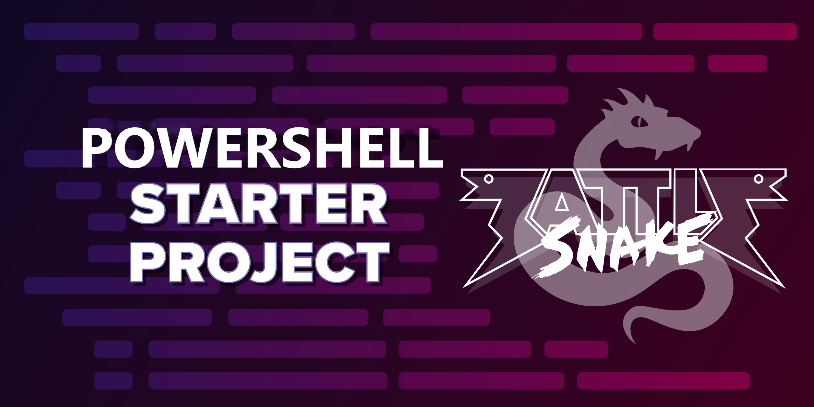

# Getting started with [Battlesnake](http://play.battlesnake.com?utm_source=github&utm_medium=readme&utm_campaign=typescript_starter&utm_content=homepage) and PowerShell with Azure Functions



This is a basic implementation of the [Battlesnake API](https://docs.battlesnake.com/references/api) in PowerShell leveraging Azure Functions. It's a great starting point for anyone wanting to program their first Battlesnake using PowerShell, and comes ready to deploy with [Azure Functions](https://docs.microsoft.com/azure/azure-functions/).

## Technologies Used

- [PowerShell](https://docs.microsoft.com/powershell/)
- [Azure Functions](https://docs.microsoft.com/azure/azure-functions/)
- [Pester - Optional](https://pester.dev/docs/quick-start)
- [Visual Studio Code - Optional](https://code.visualstudio.com/)
- [Visual Studio Code Azure Extension - Optional](https://marketplace.visualstudio.com/items?itemName=ms-vscode.vscode-node-azure-pack/)
- [Azure Functions Docker Container - Optional](https://hub.docker.com/_/microsoft-azure-functions-powershell/)
- [Docker Compose - Optional](https://docs.docker.com/compose/)

## Quickstart

The [Quick Start Coding Guide](https://docs.battlesnake.com/guides/getting-started) provides the full set of instructions to customize, register, and create your first games with your Battlesnake! The guide leverages [Azure Functions](https://docs.microsoft.com/azure/azure-functions/) to host PowerShell as a HTTP API and while the it uses [Visual Studio Code](https://code.visualstudio.com/) with [Azure VSCode Extension](https://marketplace.visualstudio.com/items?itemName=ms-vscode.vscode-node-azure-pack) to publish, the instructions can be modified to work with any other publishing methods and tools like [AzureCLI](https://docs.microsoft.com/cli/azure/install-azure-cli), [Azure PowerShell](https://docs.microsoft.com/powershell/azure), [Azure Bicep](https://docs.microsoft.com/azure/azure-resource-manager/bicep/).

### Prerequisites

- A free [Battlesnake Account](https://play.battlesnake.com/?utm_source=github&utm_medium=readme&utm_campaign=typescript_starter&utm_content=homepage)
- An Azure Account/Subscription [Azure Account](https://azure.microsoft.com/account)

---

## Customizing Your Battlesnake

Locate the `Invoke-Info` function inside [handlers.ps1](starter-snake-powershell/handlers.ps1#L4). Inside that function you should see a line that looks like this:

```PowerShell
return @{
    apiversion = "1"
    author     = "MyUsername"
    color      = "#888888"
    head       = "default"
    tail       = "default"
    version    = "0.0.1-beta"
}
```

This function is called by the game engine periodically to make sure your Battlesnake is healthy, responding correctly, and to determine how your Battlesnake will appear on the game board. See [Battlesnake Personalization](https://docs.battlesnake.com/references/personalization) for how to customize your Battlesnake's appearance using these values.

Whenever you update these values, go to the page for your Battlesnake and select 'Refresh Metadata' from the option menu. This will update your Battlesnake to use your latest configuration and those changes should be reflected in the UI as well as any new games created.

## Changing Behaviour

On every turn of each game your Battlesnake receives information about the game board and must decide its next move.

Locate the `Invoke-Move` function inside [handlers.ps1](starter-snake-powershell/handlers.ps1#L34). Possible moves are "up", "down", "left", or "right". To start your Battlesnake will choose a move randomly. Your goal as a developer is to read information sent to you about the board (available in the `GameState` variable) and decide where your Battlesnake should move next.

See the [Battlesnake Game Rules](https://docs.battlesnake.com/references/rules) for more information on playing the game, moving around the board, and improving your algorithm.

## Hosting with Azure Functions

To create an Azure Function App and publish your Battlesnake as an Azure PowerShell Function using Visual Studio Code follow [this official guide](https://docs.microsoft.com/en-us/azure/azure-functions/create-first-function-vs-code-powershell)

_Note: You can skip to 'Sign in to Azure' section._

## (Optional) Running Your Battlesnake Locally

Eventually you might want to run your Battlesnake server locally for faster testing and debugging. You can do this by installing [Azure Functions Core Tools](https://github.com/Azure/azure-functions-core-tools), renaming 'example.local.settings.json' to 'local.settings.json' and running:

```shell
func start
```

**Note:** You cannot create games on [play.battlesnake.com](https://play.battlesnake.com) using a locally running Battlesnake unless you install and use a port forwarding tool like [ngrok](https://ngrok.com/). See [Hosting Suggestions.](https://docs.battlesnake.com/references/hosting-suggestions#local)

## Running Tests

This Starter Project comes with a very simple [Pester](https://pester.dev/docs/quick-start) test suite for you to expand! Located in `tests/starter-snake-powershell/*.tests.ps1` you can run them using the following command:

```PowerShell
Invoke-Pester tests/starter-snake-powershell/*.tests.ps1
```

---

## Playing Battlesnake

### Completing Challenges

If you're looking for the Single Player Mode of Battlesnake, or something to practice with between events, check out [Challenges.](https://docs.battlesnake.com/guides/quick-start-challenges-guide)

### Joining a Battlesnake Arena

Once you've made your Battlesnake behave and survive on its own, you can enter it into the [Global Battlesnake Arena](https://play.battlesnake.com/arena/global) to see how it performs against other Battlesnakes worldwide.

Arenas will regularly create new games and rank Battlesnakes based on their results. They're a good way to get regular feedback on how well your Battlesnake is performing, and a fun way to track your progress as you develop your algorithm.

### Joining a Battlesnake League

Want to get out there to compete and win prizes? Check out the [Quick Start League Guide](https://docs.battlesnake.com/guides/quick-start-league-guide) for information on the how and when of our competitive seasons.

---

## Resources

All documentation is available at [docs.battlesnake.com](https://docs.battlesnake.com), including detailed Guides, API References, and Tips.

You can also join the Battlesnake Developer Community on [Discord](https://play.battlesnake.com/discord?utm_source=github&utm_medium=readme&utm_campaign=typescript_starter&utm_content=discord). We have a growing community of Battlesnake developers of all skill levels wanting to help everyone succeed and have fun with Battlesnake :)

Check out live Battlesnake events on [Twitch](https://www.twitch.tv/battlesnakeofficial) and see what is happening when on the [Calendar.](https://play.battlesnake.com/calendar?utm_source=github&utm_medium=readme&utm_campaign=typescript_starter&utm_content=calendar)

Want to contribute to Battlesnake? We have a number of open-source codebases and would love for you to get involved! Check out our page on [Contributing.](https://docs.battlesnake.com/guides/contributing)

## Feedback

**Do you have an issue or suggestions for Battlesnake?** Head over to our [Feedback Repository](https://play.battlesnake.com/feedback?utm_source=github&utm_medium=readme&utm_campaign=typescript_starter&utm_content=feedback) today and let us know!

**Do you have an issue or suggestions for this PowerShell starter project?** Head over to our [PowerShell Starter Project Repository](https://github.com/hestan-net/starter-snake-powershell) today and let us know!
